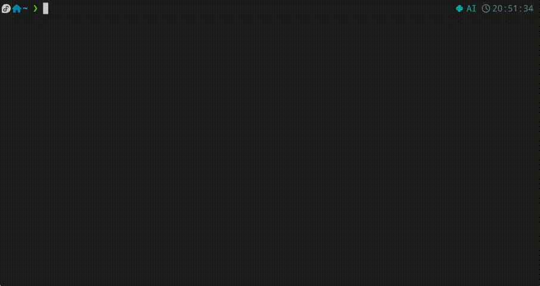

# DS Assistant CLI (CN)




一个Linux平台下在终端调用Deepseek API的脚本. (非常简陋, 因为作者没有开发经验)

## 开始

### 环境需求
要求 Python3 安装以下库:
```
openai
prompt_toolkit.
```

或者可以安装`requirement.txt`.

### 安装

1. 克隆此文档: `git clone https://github.com/PupilEarthquake/DS_Assistant_CLI.git`;
2. 进入此文件夹: `cd /Path/to/DS_Assistant_CLI`;
3. 在 `ds.py` 首行添加你的 Python 路径, 比如 `#!/home/pupilearthquake/anaconda3/envs/AI/bin/python`;
4. 添加可执行权限: `chmod +x ds.py`;
5. 创建符号链接: `sudo ln -s /path/to/your/ds.py /usr/local/bin/ds`.


### 配置文件

1. 在 `user.conf` 中填入你的 API KEY.


## 使用方法


1. `ds -h`: 显示帮助;
2. `ds ce`: 中译英功能, `ds ce -mt` 开启多翻译, 一个句子可以翻译多种版本, `ds ce -ab math` 指定学科背景, 这里指定为数学; `ds ce -t` 开启后推理模式下可以显示思考链, 其他可选参数可参考 `ds ce -h`;
3. `ds ec`: 英译中功能;
4. `ds syc`: 英语语法检查功能;
5. `ds dict`: 词典功能;
6. `ds chat`: 一般聊天;
7. `ds ls`: 显示历史聊天.


聊天记录保存在和 `ds.py` 同目录的 `chathist` 文件夹中.

# DS Assistant CLI (EN)

A script for calling the Deepseek API from the terminal on a Linux platform. (Very rudimentary, as the author has no development experience.)

## Getting Started

### Environment Requirements
Requires Python3 with the following libraries installed:
```
openai
prompt_toolkit
```

Alternatively, you can install `requirements.txt`.

### Installation

1. Clone this repository: `git clone https://github.com/PupilEarthquake/DS_Assistant_CLI.git`;
2. Navigate to the folder: `cd /Path/to/DS_Assistant_CLI`;
3. Add your Python path at the beginning of `ds.py`, e.g., `#!/home/pupilearthquake/anaconda3/envs/AI/bin/python`;
4. Make it executable: `chmod +x ds.py`;
5. Create a symbolic link: `sudo ln -s /path/to/your/ds.py /usr/local/bin/ds`.

### Configuration

1. Fill in your API KEY in `user.conf`.

## Usage

1. `ds -h` displays help;
2. `ds ce` for Chinese-to-English translation. Use `ds ce -mt` to enable multi-translation, which provides multiple versions of a sentence. `ds ce -ab math` specifies a subject background, e.g., mathematics. `ds ce -t` enables reasoning mode to display the chain of thought. For other optional parameters, refer to `ds ce -h`;
3. `ds ec` for English-to-Chinese translation;
4. `ds syc` for English grammar checking;
5. `ds dict` for dictionary functionality;
6. `ds chat` for general chatting;
7. `ds ls` to display chat history.

Chat history is saved in the `chathist` folder located in the same directory as `ds.py`.
------------------------------------------------------------------------------------------
